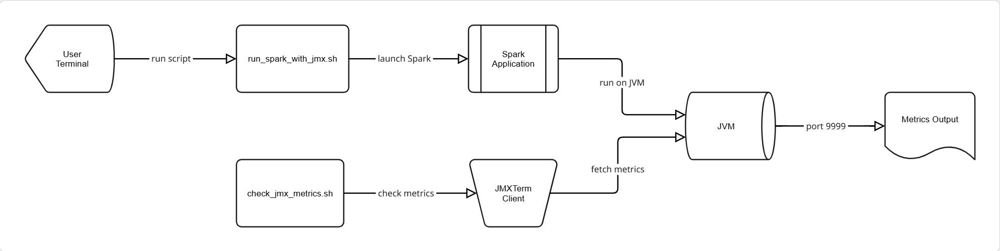

# 🧠 Spark JMX Monitoring Lab (CLI Project)


This project demonstrates how to **enable, connect, and fetch JMX metrics** from a running **Apache Spark** application using **JMXTerm** on a **Linux command-line environment**.  
It provides an end-to-end setup to help understand **JMX-based JVM metric monitoring** for Spark processes.

---

## 📁 Project Structure
```bash
spark-jmx-lab/
├── scripts/
│ ├── run_spark_with_jmx.sh # Launches Spark with JMX enabled and runs Scala app
│ └── check_jmx_metrics.sh # Connects to Spark JVM via JMXTerm and fetches metrics
├── src/
│ └── MySparkApp.scala # Spark demo program for monitoring
└── jmxterm.jar # JMXTerm client (auto-downloaded if missing)
```
---
## 🖼️ Architecture / Workflow Diagram


This diagram shows the workflow of the Spark JMX Monitoring project:
- User Terminal launches Spark or scripts
- Spark app runs in JVM with JMX enabled
- JMXTerm connects to JVM to fetch metrics
- Metrics are displayed to the user
---

## ⚙️ Prerequisites

Make sure the following are installed on your system:

- **Java 8 or higher** (Java 17 recommended)  
- **Apache Spark 3.x or 4.x**  
- **wget** (for automatic JMXTerm download)  
- **Internet access** (for first-time setup)

---

## 🚀 Running the Project

You can run this project in **two ways**:

1. **Using provided scripts (recommended)**  
2. **Running Spark and Scala manually**

---

### 🧩 Option 1 — Using Scripts (Recommended)

#### 1️⃣ Run Spark with JMX Enabled

From inside the `scripts/` directory:

```bash
cd scripts
chmod +x run_spark_with_jmx.sh
./run_spark_with_jmx.sh
```
This script will:

- Launch Spark shell with JMX enabled on port 9999
- Execute your demo app (MySparkApp.scala)

Inside Spark shell, load your Scala file:
```bash
:load src/MySparkApp.scala
```
You should see:
```bash
✅ Sum = 500500
⏳ Keeping JVM alive for JMX monitoring...
```
#### 2️⃣ Fetch JMX Metrics

Open another terminal and run:
```bash 
cd scripts
chmod +x check_jmx_metrics.sh
./check_jmx_metrics.sh
```

This script will:
- Download JMXTerm if not already available
- Connect to localhost:9999
- Display JVM metrics such as:
  - HeapMemoryUsage
  - ThreadCount / PeakThreadCount
  - SystemLoadAverage
  - CPU Load
  - Free and Total Physical Memory

### 🧩 Option 2 — Run Manually (Without Scripts)

#### 1. Start Spark shell with JMX enabled:
```bash
$SPARK_HOME/bin/spark-shell \
--conf "spark.driver.extraJavaOptions=-Dcom.sun.management.jmxremote \
-Dcom.sun.management.jmxremote.port=9999 \
-Dcom.sun.management.jmxremote.authenticate=false \
-Dcom.sun.management.jmxremote.ssl=false"
```

#### 2. Inside Spark shell, load your Scala file:
```bash
:load src/MySparkApp.scala
```
#### 3. Open another terminal and run:
```bash
cd scripts
./check_jmx_metrics.sh
```
### Sample JVM Metrics (Before Spark)


### Sample JVM Metrics (After Spark)


### Spark Shell Output


## 🧰 Useful Commands

Check Spark processes:
```bash
jps -l
```
Verify JMX port is listening:
```bash
netstat -tulnp | grep 9999
```
Manually start JMXTerm (optional):
```bash
java -jar jmxterm.jar -l localhost:9999
```
